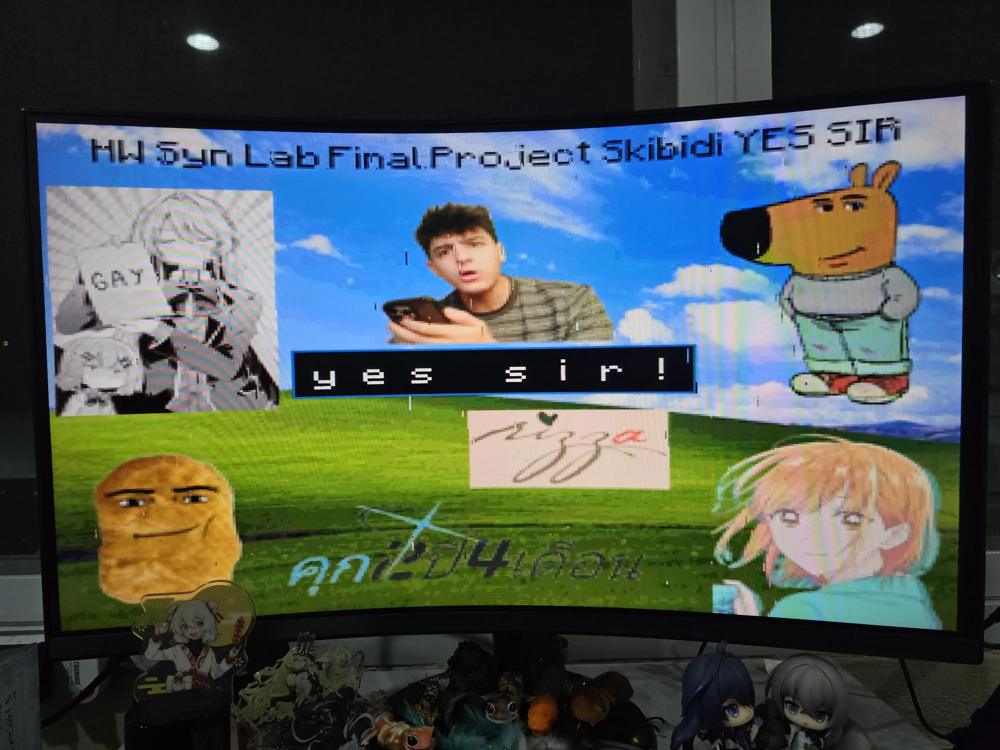

# HW Syn Lab Final Project

Gedagedigedagedago  
Abin mery alontamago  
Wede wude comfrom? Wede wude go?  
Wede jude kamfro Bagulado?

## Project Details and Requirements

- Display Text on VGA Monitor
  - Minimum 8 characters per line ✅
  - Minimum 1 line ✅
- UART Communication between two Basys 3 boards ✅

## Usage

- Synthesis and upload to both boards and keep connection between laptop and its board
- Connect each board to VGA Monitor
- Using J1 and L2 pin (Pmod connectors) for UART between boards, connect TX to RX and RX to TX
- When data is sent from Laptop A to Board A, Board A will forward the data to Board B
  using Pmod ports, when Board B receives the data, it will display the text on the VGA Monitor and also laptop B terminal
- This work the sames in other direction

## Software

AMD Vivado v2024.1

## Project Structure

- Poetry Files - To use with Jupyter Notebook
- Images & Font - Used by Jupyter Notebook to generate ROM
- Jupyter Notebook Files
  - `bgImage.ipynb` - For drawing wonderful ~~skibidi~~ background image
  - `EncodeImage.ipynb` - Using image from `bgImage.ipynb`, scales, reduce color depth and generate ROM (.mem) file
  - `encodeFont.ipynb` - Encode all characters from ASCII 32 (Spacebar) to 126 (~) to .mem file
- Verilog Sources (`final-real.srcs/sources_1/new`)
  - `system.v` - Top module
    - `uart.v` - UART module, do both receive, mirror to TX and output data
      - `baudrate_gen.v` - Generate clock for UART
      - `uart_tx.v` - Handle transmit
      - `uart_rx.v` - Handle receive
    - `uartClockMajik.v` - Magic that fixes bugs, do not touch and please do not ask me how
    - `circularLinkedList.v` - Link list that will drop least recent data when full (It's not circular linked list 🤡)
    - `clockDiv.v` - Counter Based Clock Divider
    - `quadSevenSeg.v` - Controls 7-segment display
      - `hexTo7Segment.v` - Decode ASCII code to Siekoo for 7-segment display
    - `pixel.v` - Module that outputs R, G, B for current pixel
      - `bgROM.v` - Module for accessing background image ROM
        - `bg.mem` - Generated by `EncodeImage.ipynb`
      - `fontROM.v` - Module for accessing font ROM
        - `font.mem` - Generated by `encodeFont.ipynb`
      - `rgb_pixel.v` - Module for generating RGB pixel around typing area
    - `vga_sync.v` - Module for generating VGA sync signals and also count positions
- Verilog Test Source (`final-real.srcs/sim_1/new`)
  - `testCircularLinkedList.v` - Tests `circularLinkedList.v` (which is not Circular Linked List 🤡)
- Verilog IP (Generated)
  - `clk_wiz_0` - Clock Wizard for generating (close to) 25.175 MHz

## Demo

Note: Not my table and so any acrylic stand there

As you can see, there are some artifacts due to clock wizard not generating exactly 25.175 MHz (Closest it can be is 25.17301 MHz)

Thank you @Bee0Theepob for suggesting images (eg. Chill Guy, pizza) to put in this background

## Interesting Features

- Also display text on 7-segment display (Only for applicable characters like capital letters)
- Has wonderful background
- Has RGB animation around typing area

## Limitation

Image needs to be scaled down to 320x240 because of ROM space limitation but it still display clearly!
